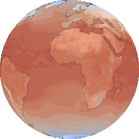
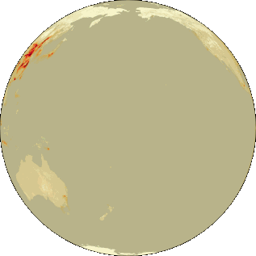
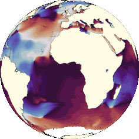
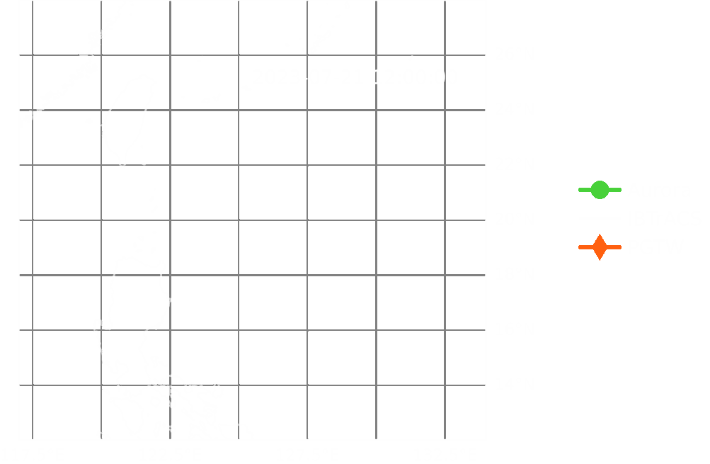

&nbsp;&nbsp;&nbsp;&nbsp;&nbsp;&nbsp;&nbsp;&nbsp;&nbsp;

# Aurora: A Foundation Model for the Earth System

[](https://github.com/microsoft/Aurora/actions/workflows/ci.yaml)
[](https://microsoft.github.io/aurora)
[](https://arxiv.org/abs/2405.13063)
[](https://doi.org/10.5281/zenodo.14983583)

Implementation of the Aurora model for Earth system forecasting.

[Link to the paper.](https://www.nature.com/articles/s41586-025-09005-y)

[Please see the documentation for detailed instructions and more examples.](https://microsoft.github.io/aurora)
You can also directly go to [a full-fledged example that runs the model on ERA5](https://microsoft.github.io/aurora/example_era5.html).

Cite us as follows:

```
@article{bodnar2025aurora,
    title = {A Foundation Model for the Earth System},
    author = {Cristian Bodnar and Wessel P. Bruinsma and Ana Lucic and Megan Stanley and Anna Allen and Johannes Brandstetter and Patrick Garvan and Maik Riechert and Jonathan A. Weyn and Haiyu Dong and Jayesh K. Gupta and Kit Thambiratnam and Alexander T. Archibald and Chun-Chieh Wu and Elizabeth Heider and Max Welling and Richard E. Turner and Paris Perdikaris},
    journal = {Nature},
    year = {2025},
    month = {May},
    day = {21},
    issn = {1476-4687},
    doi = {10.1038/s41586-025-09005-y},
    url = {https://doi.org/10.1038/s41586-025-09005-y},
}
```

Contents:

- [What is Aurora?](#what-is-aurora)
- [Getting Started](#getting-started)
- [Contributing](#contributing)
- [License](#license)
- [Security](#security)
- [Responsible AI Transparency Documentation](#responsible-ai-transparency-documentation)
- [Trademarks](#trademarks)
- [FAQ](#faq)

Please email [AIWeatherClimate@microsoft.com](mailto:AIWeatherClimate@microsoft.com)
if you are interested in using Aurora for commercial applications.
For research-related questions or technical support with the code here,
please [open an issue](https://github.com/microsoft/aurora/issues/new/choose)
or reach out to the authors of the paper.

## What is Aurora?

Aurora is a machine learning model that can predict atmospheric variables, such as temperature.
It is a _foundation model_, which means that it was first generally trained on a lot of data,
and then can be adapted to specialised atmospheric forecasting tasks with relatively little data.
We provide four such specialised versions:
one for medium-resolution weather prediction,
one for high-resolution weather prediction,
one for air pollution prediction,
and one for ocean wave prediction.

## Getting Started

Install with `pip`:

```bash
pip install microsoft-aurora
```

Or with `conda` / `mamba`:

```bash
mamba install microsoft-aurora -c conda-forge
```

Run the pretrained small model on random data:

```python
from datetime import datetime

import torch

from aurora import AuroraSmallPretrained, Batch, Metadata

model = AuroraSmallPretrained()
model.load_checkpoint()

batch = Batch(
    surf_vars={k: torch.randn(1, 2, 17, 32) for k in ("2t", "10u", "10v", "msl")},
    static_vars={k: torch.randn(17, 32) for k in ("lsm", "z", "slt")},
    atmos_vars={k: torch.randn(1, 2, 4, 17, 32) for k in ("z", "u", "v", "t", "q")},
    metadata=Metadata(
        lat=torch.linspace(90, -90, 17),
        lon=torch.linspace(0, 360, 32 + 1)[:-1],
        time=(datetime(2020, 6, 1, 12, 0),),
        atmos_levels=(100, 250, 500, 850),
    ),
)

prediction = model.forward(batch)

print(prediction.surf_vars["2t"])
```

Note that this will incur a 500 MB download.

Please read the [documentation](https://microsoft.github.io/aurora) for more detailed instructions and for which models are available.

## Contributing

See [`CONTRIBUTING.md`](CONTRIBUTING.md).

## License

See [`LICENSE.txt`](LICENSE.txt).

## Security

See [`SECURITY.md`](SECURITY.md).

## Responsible AI Transparency Documentation

An AI system includes not only the technology, but also the people who will use it, the people who will be affected by it, and the environment in which it is deployed.
Creating a system that is fit for its intended purpose requires an understanding of how the technology works, its capabilities and limitations, and how to achieve the best performance.
Microsoft has a broad effort to put our AI principles into practice.
To find out more, see [Responsible AI principles from Microsoft](https://www.microsoft.com/en-us/ai/responsible-ai).

### Use of this code
Our goal in publishing this code is
(1) to facilitate reproducibility of our paper and
(2) to support and accelerate further research into foundation model for atmospheric forecasting.
This code has not been developed nor tested for non-academic purposes and hence should only be used as such at completely your own risk.

### Limitations
Although Aurora was trained to accurately predict future weather, air pollution, and ocean waves,
Aurora is based on neural networks, which means that there are no strict guarantees that predictions will always be accurate.
Altering the inputs, providing a sample that was not in the training set,
or even providing a sample that was in the training set but is simply unlucky may result in arbitrarily poor predictions.
In addition, even though Aurora was trained on a wide variety of data sets,
it is possible that Aurora inherits biases present in any one of those data sets.
A forecasting system like Aurora is only one piece of the puzzle in a weather prediction pipeline,
and its outputs are not meant to be directly used by people or businesses to plan their operations.
A series of additional verification tests are needed before it can become operationally useful.

In addition to the above, the models published here are streamlined versions of the models
originally developed internally.
Whereas we tried to be as thorough as possible, it is possible that the models published here
deviate from the original model in subtle, unintended ways.
This may affect predictive performance.

### Data
The models included in the code have been trained on a variety of publicly available data.
A description of all data, including download links, can be found in [Supplementary C of the paper](https://arxiv.org/pdf/2405.13063).
The checkpoints include data from ERA5, CMCC, IFS-HR, HRES T0, GFS T0 analysis, and GFS forecasts.

### Evaluations
All versions of Aurora were extensively evaluated by evaluating predictions on data not seen during training.
These evaluations not only compare measures of accuracy, such as the root mean square error and anomaly correlation coefficient,
but also look at the behaviour in extreme situations, like extreme heat and cold, and rare events, like Storm Ciarán in 2023.
These evaluations are the main topic of [the paper](https://arxiv.org/pdf/2405.13063).

*Note: The documentation included in this file is for informational purposes only and is not intended to supersede the applicable license terms.*

## Trademarks

This project may contain trademarks or logos for projects, products, or services.
Authorized use of Microsoft trademarks or logos is subject to and must follow [Microsoft's Trademark & Brand Guidelines](https://www.microsoft.com/en-us/legal/intellectualproperty/trademarks/usage/general).
Use of Microsoft trademarks or logos in modified versions of this project must not cause confusion or imply Microsoft sponsorship.
Any use of third-party trademarks or logos are subject to those third-party's policies.

## FAQ

### How do I setup the repo for local development?

First, install the repository in editable mode and setup `pre-commit`:

```bash
make install
```

To run the tests and print coverage, run

```bash
make test
```

You can then explore the coverage in the browser by opening `htmlcov/index.html`.

To locally build the documentation, run

```bash
make docs
```

To locally view the documentation, open `docs/_build/index.html` in your browser.
